# GCM Agent Architecture

**Version:** 1.0  
**Last Updated:** 2026-06-05  
**Status:** Draft

## Table of Contents

1. [Overview](#overview)
2. [Architecture Components](#architecture-components)
3. [Configuration Management](#configuration-management)
4. [Authentication Flow](#authentication-flow)
5. [Tool Discovery & Loading](#tool-discovery--loading)
6. [Local Deployment Architecture](#local-deployment-architecture)
7. [Watsonx Orchestrate Integration Design](#watsonx-orchestrate-integration-design)
8. [Security Considerations](#security-considerations)
9. [Data Flow Diagrams](#data-flow-diagrams)
10. [Implementation Guidelines](#implementation-guidelines)

---

## Overview

The GCM Agent is a LangChain-based AI agent designed to integrate with IBM Guardium Cryptography Manager (GCM) through its embedded Model Context Protocol (MCP) server. This architecture enables natural language interaction with GCM's cryptographic asset management capabilities while maintaining enterprise-grade security and scalability.

### Purpose

The agent serves as an intelligent interface layer that:
- Translates natural language queries into GCM API operations
- Manages complex multi-step workflows automatically
- Provides real-time access to cryptographic asset data
- Enforces role-based access control (RBAC) policies
- Supports dynamic tool discovery for optimal performance

### Key Design Principles

1. **Security First**: No hardcoded credentials; all sensitive data stored in secure vaults
2. **Local Execution**: Runs on user machines without cloud dependencies
3. **Portability**: Designed for future integration with Watsonx Orchestrate
4. **Performance**: Dynamic tool loading minimizes overhead
5. **Maintainability**: Clear separation of concerns across components

---

## Architecture Components

### High-Level Architecture

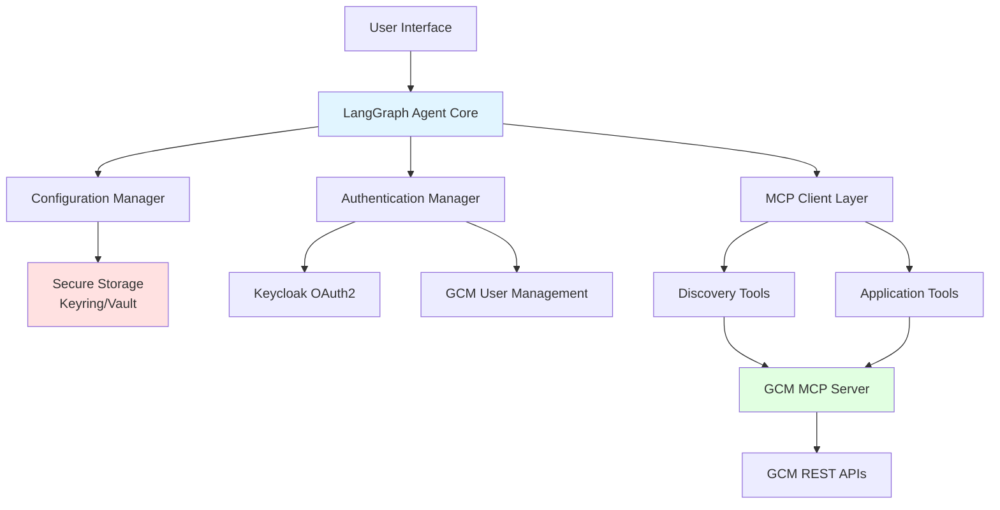

### 1. Agent Core (LangGraph-based)

The agent core implements the LangGraph StateGraph pattern with the following structure:

**Key Components:**
- **LLM Backend**: IBM WatsonX (configurable for other providers)
- **Agent Wrapper**: [`create_agent()`](https://python.langchain.com/docs/modules/agents/) from LangChain
- **State Management**: [`MessagesState`](https://langchain-ai.github.io/langgraph/reference/graphs/#langgraph.graph.MessagesState) for conversation history
- **Graph Structure**: Simple linear flow (START → agent → END)

**Implementation Pattern:**

```python
from langchain.agents import create_agent
from langgraph.graph import StateGraph, MessagesState, START, END

def build_agent(llm, tools):
    """Build LangGraph agent with GCM tools."""
    react_agent = create_agent(
        model=llm,
        tools=tools,
        system_prompt=SYSTEM_PROMPT
    )
    
    async def agent_node(state: MessagesState) -> dict:
        result = await react_agent.ainvoke({"messages": state["messages"]})
        return {"messages": result["messages"]}
    
    graph = StateGraph(MessagesState)
    graph.add_node("agent", agent_node)
    graph.add_edge(START, "agent")
    graph.add_edge("agent", END)
    
    return graph.compile()
```

**Critical Requirements:**
- Agent node MUST be async
- Use [`create_agent()`](https://python.langchain.com/docs/modules/agents/) wrapper, not raw LLM
- No separate tool node needed (handled internally by [`create_agent()`](https://python.langchain.com/docs/modules/agents/))
- System prompt must instruct to "present ACTUAL VALUES" not field descriptions

### 2. MCP Server Integration Layer

The integration layer manages communication with the GCM MCP server using [`langchain-mcp-adapters`](https://github.com/langchain-ai/langchain-mcp-adapters).

**Key Components:**

```python
from langchain_mcp_adapters.client import MultiServerMCPClient
import httpx

class GCMMCPClient:
    """Manages GCM MCP server connection and tool loading."""
    
    def __init__(self, config_manager, auth_manager):
        self.config = config_manager
        self.auth = auth_manager
        self._client = None
    
    def _client_factory(self, **kwargs) -> httpx.AsyncClient:
        """Custom client factory with authentication and SSL handling."""
        # Get OAuth2 token from auth manager
        token = self.auth.get_token()
        
        # Inject token into headers
        headers = dict(kwargs.pop("headers", None) or {})
        headers["Authorization"] = f"Bearer {token}"
        
        # Handle SSL verification
        kwargs.pop("verify", None)
        ssl_verify = self.config.get("ssl_verify", True)
        
        return httpx.AsyncClient(
            verify=ssl_verify,
            headers=headers,
            **kwargs
        )
    
    def _build_config(self) -> dict:
        """Build MCP client configuration."""
        gcm_url = self.config.get("gcm_url")
        
        return {
            "gcm": {
                "transport": "streamable_http",  # Required for remote server
                "url": gcm_url,
                "httpx_client_factory": self._client_factory
            }
        }
    
    async def get_tools(self, discovery_mode: bool = False) -> list:
        """Load tools from GCM MCP server."""
        config = self._build_config()
        
        # Add discovery header if requested
        if discovery_mode:
            config["gcm"]["headers"] = {
                "x-mcp-enable-discovery": "true"
            }
        
        client = MultiServerMCPClient(config)
        return await client.get_tools()
```

**Critical Patterns:**
- Must use `streamable_http` transport for remote GCM server
- Custom [`_client_factory()`](https://docs.python-httpx.org/advanced/#custom-transports) required for token injection
- Must pop `verify` kwarg before creating [`AsyncClient`](https://docs.python-httpx.org/api/#asyncclient) to avoid conflicts
- Tools loaded during initialization, not runtime (performance)

### 3. Configuration Management System

Replaces environment variables with secure storage and UI-based configuration.

**Architecture:**

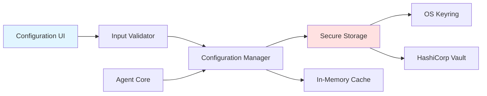

**Configuration Manager Interface:**

```python
from abc import ABC, abstractmethod
from typing import Any, Optional
import keyring

class ConfigurationManager(ABC):
    """Abstract base for configuration management."""
    
    @abstractmethod
    def get(self, key: str) -> Optional[str]:
        """Retrieve configuration value."""
        pass
    
    @abstractmethod
    def set(self, key: str, value: str, secure: bool = False):
        """Store configuration value."""
        pass
    
    @abstractmethod
    def delete(self, key: str):
        """Remove configuration value."""
        pass

class KeyringConfigManager(ConfigurationManager):
    """Configuration manager using OS keyring."""
    
    SERVICE_NAME = "gcm-agent"
    
    def __init__(self):
        self._cache = {}
    
    def get(self, key: str) -> Optional[str]:
        """Get value from cache or keyring."""
        if key in self._cache:
            return self._cache[key]
        
        value = keyring.get_password(self.SERVICE_NAME, key)
        if value:
            self._cache[key] = value
        return value
    
    def set(self, key: str, value: str, secure: bool = False):
        """Store value in keyring."""
        if secure:
            keyring.set_password(self.SERVICE_NAME, key, value)
        self._cache[key] = value
    
    def delete(self, key: str):
        """Remove value from keyring and cache."""
        try:
            keyring.delete_password(self.SERVICE_NAME, key)
        except keyring.errors.PasswordDeleteError:
            pass
        self._cache.pop(key, None)
```

---

## Configuration Management

### Secure Storage Mechanism

The agent uses OS-native secure storage instead of environment variables:

**Storage Options:**

1. **macOS**: Keychain Access
2. **Windows**: Windows Credential Manager
3. **Linux**: Secret Service API (GNOME Keyring, KWallet)
4. **Enterprise**: HashiCorp Vault integration

**Benefits:**
- **Security**: Credentials never exposed in process environment
- **Portability**: Configuration travels with user profile
- **Auditability**: Changes tracked in secure storage
- **User-Friendly**: GUI-based configuration vs manual file editing

### Configuration UI Design

**Technology Stack:**
- **Frontend**: React or Electron for cross-platform desktop app
- **Backend**: FastAPI for local REST API
- **State Management**: React Context or Redux

**UI Mockup:**

```
┌─────────────────────────────────────────┐
│  GCM Agent Configuration                │
├─────────────────────────────────────────┤
│                                         │
│  [GCM Server Settings]                  │
│  ┌─────────────────────────────────┐   │
│  │ GCM URL: https://gcm.example... │   │
│  │ Hostname: gcm.example.com       │   │
│  │ API Port: 443                   │   │
│  │ ☑ Enable SSL Verification      │   │
│  └─────────────────────────────────┘   │
│                                         │
│  [Authentication]                       │
│  ┌─────────────────────────────────┐   │
│  │ Username: ******************    │   │
│  │ Password: ******************    │   │
│  │ Client ID: ****************     │   │
│  │ Client Secret: *************    │   │
│  └─────────────────────────────────┘   │
│                                         │
│  [LLM Configuration]                    │
│  ┌─────────────────────────────────┐   │
│  │ Provider: [WatsonX ▼]           │   │
│  │ API Key: *******************    │   │
│  │ Project ID: ****************    │   │
│  │ Model: granite-3-8b-instruct    │   │
│  └─────────────────────────────────┘   │
│                                         │
│  [Test Connection]  [Save]  [Cancel]   │
└─────────────────────────────────────────┘
```

### Configuration Schema

```python
from pydantic import BaseModel, Field, HttpUrl

class GCMConfiguration(BaseModel):
    """GCM agent configuration schema."""
    
    # GCM Server
    gcm_url: HttpUrl = Field(..., description="GCM MCP server URL")
    gcm_hostname: str = Field(..., description="GCM hostname")
    api_port: int = Field(default=443, description="GCM API port")
    ssl_verify: bool = Field(default=True, description="Enable SSL verification")
    
    # Keycloak OAuth2
    keycloak_port: int = Field(default=443, description="Keycloak port")
    realm: str = Field(default="master", description="Keycloak realm")
    client_id: str = Field(..., description="OAuth2 client ID")
    client_secret: str = Field(..., description="OAuth2 client secret")
    
    # GCM Credentials
    username: str = Field(..., description="GCM username")
    password: str = Field(..., description="GCM password")
    
    # LLM Configuration
    llm_provider: str = Field(default="watsonx", description="LLM provider")
    llm_api_key: str = Field(..., description="LLM API key")
    llm_project_id: Optional[str] = Field(None, description="WatsonX project ID")
    llm_model: str = Field(default="ibm/granite-3-8b-instruct", description="Model ID")
    
    # Agent Settings
    discovery_mode: bool = Field(default=False, description="Enable discovery tools")
    tool_cache_ttl: int = Field(default=3600, description="Tool cache TTL (seconds)")
```

---

## Authentication Flow

### Two-Step OAuth2 Authentication

The GCM MCP server requires a two-step authentication process:

1. **Step 1**: Obtain OAuth2 access token from Keycloak
2. **Step 2**: Authorize with GCM user management endpoint

**Critical**: Both steps are required. Missing either causes silent authentication failure.

### Authentication Flow Diagram

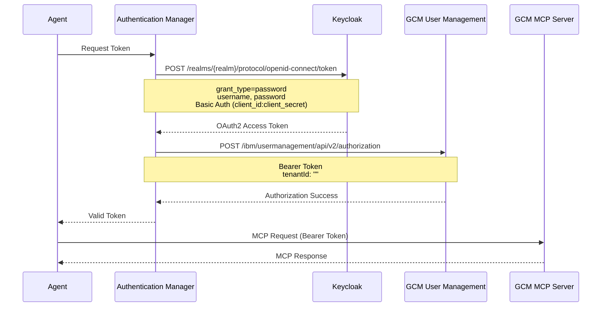

### Authentication Manager Implementation

```python
import base64
import httpx
from typing import Optional
from datetime import datetime, timedelta

class GCMAuthenticationManager:
    """Manages GCM two-step OAuth2 authentication."""
    
    def __init__(self, config_manager: ConfigurationManager):
        self.config = config_manager
        self._token = None
        self._token_expiry = None
    
    def get_token(self, force_refresh: bool = False) -> Optional[str]:
        """Get valid OAuth2 token, refreshing if necessary."""
        if not force_refresh and self._is_token_valid():
            return self._token
        
        return self._fetch_token()
    
    def _is_token_valid(self) -> bool:
        """Check if cached token is still valid."""
        if not self._token or not self._token_expiry:
            return False
        
        # Refresh 5 minutes before expiry
        return datetime.now() < (self._token_expiry - timedelta(minutes=5))
    
    def _fetch_token(self) -> Optional[str]:
        """Execute two-step authentication flow."""
        # Step 1: Get OAuth2 token from Keycloak
        access_token = self._get_keycloak_token()
        if not access_token:
            return None
        
        # Step 2: Authorize with GCM user management
        if not self._authorize_gcm(access_token):
            return None
        
        # Cache token
        self._token = access_token
        self._token_expiry = datetime.now() + timedelta(hours=1)
        
        return access_token
    
    def _get_keycloak_token(self) -> Optional[str]:
        """Step 1: Obtain OAuth2 token from Keycloak."""
        gcm_hostname = self.config.get("gcm_hostname")
        keycloak_port = self.config.get("keycloak_port") or "443"
        realm = self.config.get("realm") or "master"
        username = self.config.get("username")
        password = self.config.get("password")
        client_id = self.config.get("client_id")
        client_secret = self.config.get("client_secret")
        
        # Build Keycloak token endpoint
        keycloak_url = f"https://{gcm_hostname}:{keycloak_port}"
        token_endpoint = f"{keycloak_url}/realms/{realm}/protocol/openid-connect/token"
        
        # Create Basic Auth header
        basic_auth = base64.b64encode(
            f"{client_id}:{client_secret}".encode()
        ).decode()
        
        try:
            with httpx.Client(verify=True, timeout=30.0) as client:
                response = client.post(
                    token_endpoint,
                    data={
                        "grant_type": "password",
                        "username": username,
                        "password": password,
                        "scope": "openid"
                    },
                    headers={"Authorization": f"Basic {basic_auth}"}
                )
                response.raise_for_status()
                return response.json().get("access_token")
        
        except httpx.HTTPError as e:
            print(f"Keycloak authentication failed: {e}")
            return None
    
    def _authorize_gcm(self, access_token: str) -> bool:
        """Step 2: Authorize with GCM user management endpoint."""
        gcm_hostname = self.config.get("gcm_hostname")
        api_port = self.config.get("api_port") or "443"
        
        gcm_base_url = f"https://{gcm_hostname}:{api_port}"
        auth_endpoint = f"{gcm_base_url}/ibm/usermanagement/api/v2/authorization"
        
        try:
            with httpx.Client(verify=True, timeout=30.0) as client:
                response = client.post(
                    auth_endpoint,
                    json={"tenantId": ""},
                    headers={"Authorization": f"Bearer {access_token}"}
                )
                response.raise_for_status()
                return True
        
        except httpx.HTTPError as e:
            print(f"GCM authorization failed: {e}")
            return False
```

### Token Injection Pattern

The OAuth2 token must be injected into the [`httpx.AsyncClient`](https://docs.python-httpx.org/api/#asyncclient) headers via a custom [`_client_factory()`](https://docs.python-httpx.org/advanced/#custom-transports):

```python
def _client_factory(self, **kwargs) -> httpx.AsyncClient:
    """Custom client factory with token injection."""
    # Get fresh token
    token = self.auth_manager.get_token()
    
    # Inject into headers
    headers = dict(kwargs.pop("headers", None) or {})
    headers["Authorization"] = f"Bearer {token}"
    
    # Handle SSL verification
    kwargs.pop("verify", None)  # Must pop to avoid conflicts
    ssl_verify = self.config.get("ssl_verify", True)
    
    return httpx.AsyncClient(
        verify=ssl_verify,
        headers=headers,
        **kwargs
    )
```

**Critical Pattern**: Must pop `verify` kwarg before creating [`AsyncClient`](https://docs.python-httpx.org/api/#asyncclient) to avoid parameter conflicts.

---

## Tool Discovery & Loading

### Discovery Mode vs Standard Mode

The GCM MCP server supports two operational modes controlled by the `x-mcp-enable-discovery` header:

| Mode | Header Value | Tools Returned | Use Case |
|------|-------------|----------------|----------|
| **Standard** | `false` or omitted | All 26 application tools | Direct tool access, known workflows |
| **Discovery** | `true` | 4 discovery tools + 1 execute tool | Dynamic exploration, unknown requirements |

### Discovery Tools

When discovery mode is enabled, the agent receives:

1. **`search`**: Find tools by keywords or patterns
2. **`get_schema`**: Get detailed information about specific tools
3. **`list_tools`**: Browse all available tools
4. **`tags`**: Explore tools organized by categories
5. **`execute`**: Run workflows in sandboxed environment with RBAC enforcement

### Dynamic Tool Loading Strategy

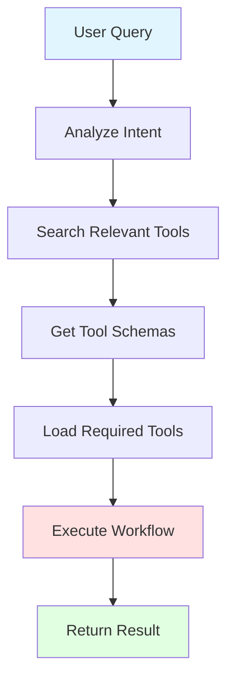

### Tool Execution Flow

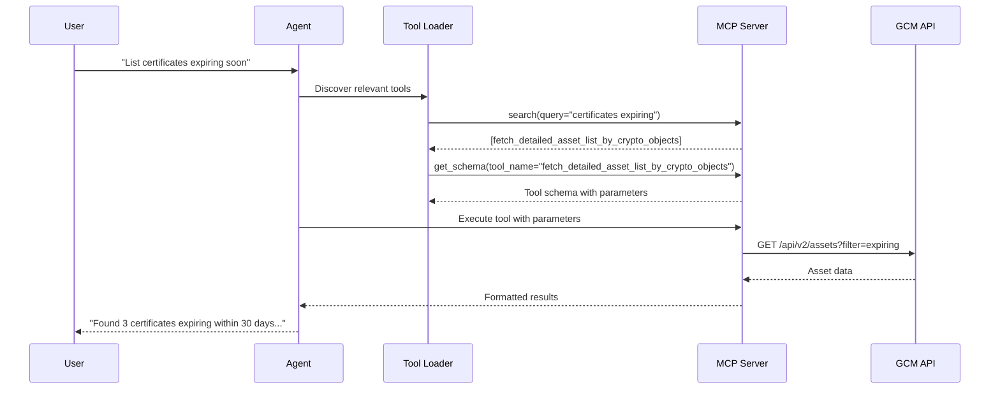

### Performance Optimization

**Tool Loading Best Practices:**

1. **Load at Initialization**: Load tools during agent startup, not runtime
2. **Cache Schemas**: Cache tool schemas to avoid repeated lookups
3. **Batch Operations**: Combine multiple tool calls when possible
4. **Lazy Loading**: Only load tools when needed in discovery mode

---

## Local Deployment Architecture

### System Requirements

**Minimum Requirements:**
- **OS**: macOS 10.15+, Windows 10+, or Linux (Ubuntu 20.04+)
- **Python**: 3.11 or later
- **Memory**: 4 GB RAM
- **Storage**: 500 MB for dependencies
- **Network**: HTTPS access to GCM server

**Recommended Requirements:**
- **Memory**: 8 GB RAM
- **Storage**: 2 GB for models and cache
- **Network**: Low-latency connection to GCM server

### Dependency Management

**Core Dependencies:**

```txt
# requirements.txt
langchain>=0.1.0
langgraph>=0.1.0
langchain-ibm>=0.1.0
langchain-core>=0.1.0
langchain-mcp-adapters>=0.1.0
httpx>=0.25.0
pydantic>=2.0.0
pydantic-settings>=2.0.0
keyring>=24.0.0
python-dotenv>=1.0.0
langsmith==0.7.10

# Optional: UI dependencies
fastapi>=0.104.0
uvicorn>=0.24.0
```

### Local Setup Architecture

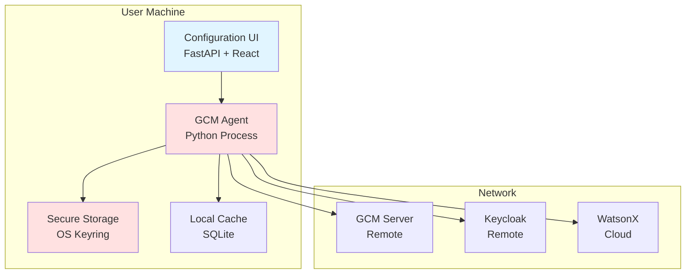

### Directory Structure

```
gcm-agent/
├── src/
│   ├── agent/
│   │   ├── __init__.py
│   │   ├── core.py              # LangGraph agent implementation
│   │   └── prompts.py           # System prompts
│   ├── auth/
│   │   ├── __init__.py
│   │   ├── manager.py           # Authentication manager
│   │   └── token_cache.py       # Token caching
│   ├── config/
│   │   ├── __init__.py
│   │   ├── manager.py           # Configuration manager
│   │   ├── schema.py            # Pydantic schemas
│   │   └── migrator.py          # Environment variable migration
│   ├── mcp/
│   │   ├── __init__.py
│   │   ├── client.py            # MCP client wrapper
│   │   └── tools.py             # Tool management
│   └── ui/
│       ├── __init__.py
│       ├── api.py               # FastAPI backend
│       └── frontend/            # React UI
├── tests/
│   ├── test_agent.py
│   ├── test_auth.py
│   └── test_config.py
├── docs/
│   └── architecture/
│       └── GCM-Agent-Architecture.md
├── requirements.txt
├── setup.py
└── README.md
```

---

## Watsonx Orchestrate Integration Design

### Integration Architecture

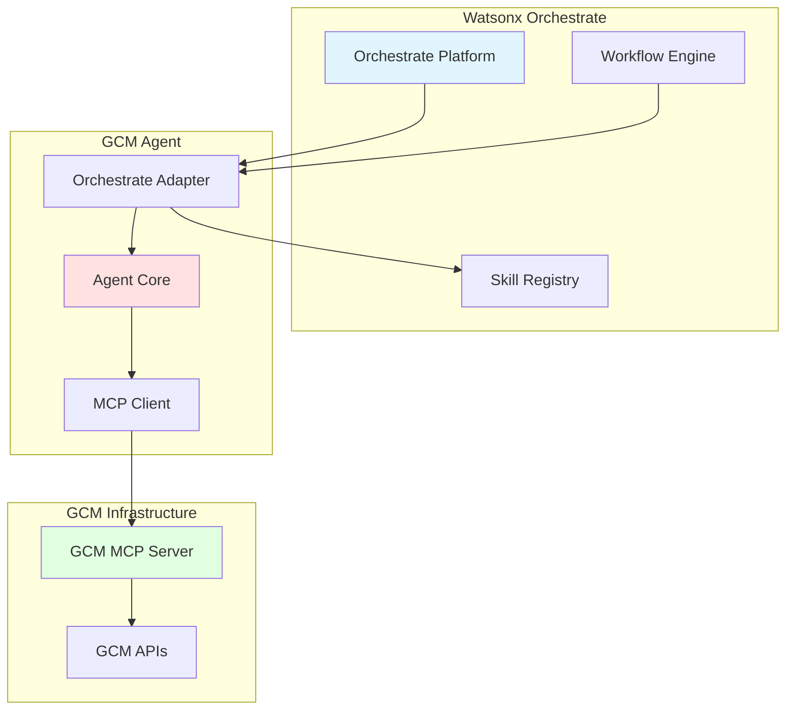

### Compatibility Considerations

**Design Principles for Portability:**

1. **Abstraction Layer**: Separate agent logic from deployment environment
2. **Standard Interfaces**: Use OpenAPI/REST for external communication
3. **Stateless Operations**: Avoid local state dependencies
4. **Configuration Injection**: Accept configuration from external sources

### API/Interface Design for Portability

**REST API Wrapper:**

```python
from fastapi import FastAPI, HTTPException
from pydantic import BaseModel

app = FastAPI(title="GCM Agent API")

class AgentRequest(BaseModel):
    """Standard agent request format."""
    query: str
    context: Dict[str, Any] = {}
    session_id: Optional[str] = None

class AgentResponse(BaseModel):
    """Standard agent response format."""
    result: str
    tools_used: List[str]
    execution_time: float
    session_id: str

@app.post("/agent/execute", response_model=AgentResponse)
async def execute_agent(request: AgentRequest):
    """Execute agent request via REST API."""
    try:
        result = await adapter.execute({
            "query": request.query,
            "context": request.context,
            "session_id": request.session_id
        })
        return AgentResponse(**result)
    
    except Exception as e:
        raise HTTPException(status_code=500, detail=str(e))

@app.get("/agent/health")
async def health_check():
    """Health check endpoint."""
    return {"status": "healthy"}
```

---

## Security Considerations

### Credential Storage

**Security Requirements:**

1. **No Plaintext Storage**: All credentials encrypted at rest
2. **OS-Level Protection**: Leverage OS security features
3. **Access Control**: Restrict access to authorized processes
4. **Audit Trail**: Log credential access (without exposing values)

### SSL/TLS Handling

**Certificate Validation:**

```python
import ssl
import certifi
import httpx

class SSLConfigManager:
    """Manage SSL/TLS configuration."""
    
    @staticmethod
    def create_ssl_context(
        verify: bool = True,
        cert_path: Optional[str] = None,
        key_path: Optional[str] = None
    ) -> ssl.SSLContext:
        """Create SSL context with proper validation."""
        if verify:
            context = ssl.create_default_context(cafile=certifi.where())
            context.check_hostname = True
            context.verify_mode = ssl.CERT_REQUIRED
        else:
            context = ssl.create_default_context()
            context.check_hostname = False
            context.verify_mode = ssl.CERT_NONE
        
        # Load client certificate if provided
        if cert_path and key_path:
            context.load_cert_chain(cert_path, key_path)
        
        return context
```

**Best Practices:**
1. **Default to Verification**: Always verify SSL certificates in production
2. **Custom CA Support**: Allow custom CA certificates for enterprise environments
3. **Certificate Pinning**: Consider certificate pinning for critical connections
4. **Expiry Monitoring**: Monitor certificate expiration dates

### RBAC Enforcement

**Role-Based Access Control Configuration:**

The GCM MCP server enforces RBAC at the tool call level through [`charts/aim-mcp-server/values.yaml`](charts/aim-mcp-server/values.yaml):

```yaml
version: 1
backends:
  - name: gcm
    prefix: gcm_
    type: url
    location: https://gcm.example.com/api/openapi.json
    server: https://gcm.example.com
    rbac:
      default_behaviour: enabled  # All tools visible by default
      tags:
        - name: certificates
          enabled: true
        - name: policies
          enabled: true
          exclusion:
            - delete_policy  # Disallow policy deletion
        - name: admin
          enabled: false  # Disable all admin tools
```

**RBAC Enforcement Flow:**

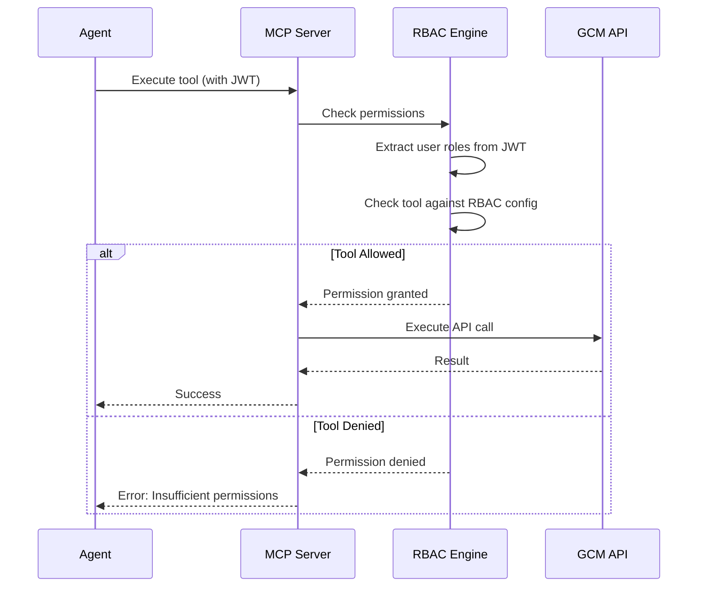

---

## Data Flow Diagrams

### Complete Request Flow

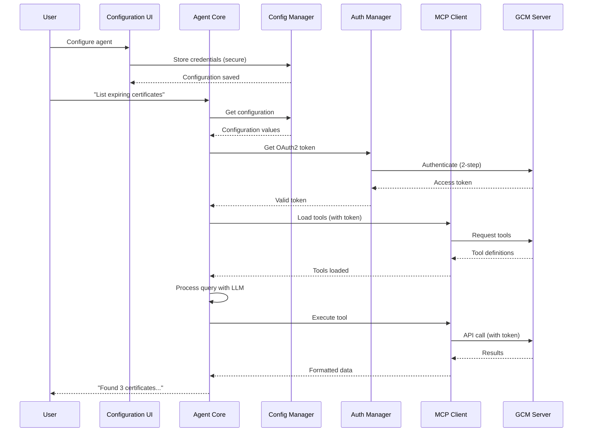

### Configuration Management Flow

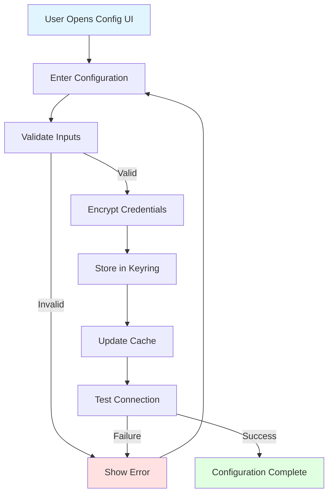

### Tool Discovery Flow

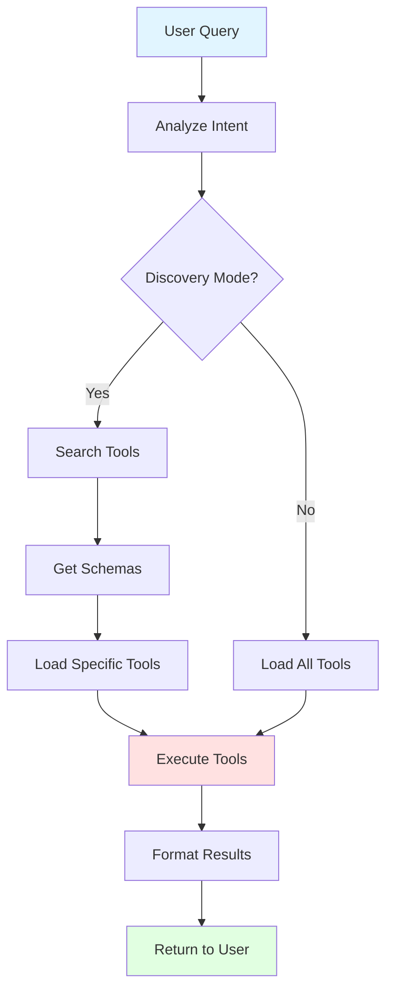

---

## Implementation Guidelines

### Getting Started

**Step 1: Environment Setup**

```bash
# Create virtual environment
python3.11 -m venv .venv
source .venv/bin/activate

# Install dependencies
pip install -r requirements.txt
```

**Step 2: Configuration**

```python
from src.config.manager import KeyringConfigManager

# Initialize configuration manager
config = KeyringConfigManager()

# Store GCM configuration
config.set("gcm_url", "https://gcm.example.com:443/ibm/mcp/mcp")
config.set("gcm_hostname", "gcm.example.com")
config.set("username", "admin", secure=True)
config.set("password", "secret", secure=True)
config.set("client_id", "gcm-client", secure=True)
config.set("client_secret", "client-secret", secure=True)

# Store LLM configuration
config.set("llm_api_key", "watsonx-api-key", secure=True)
config.set("llm_project_id", "project-id")
config.set("llm_model", "ibm/granite-3-8b-instruct")
```

**Step 3: Initialize Agent**

```python
from src.agent.core import build_agent
from src.auth.manager import GCMAuthenticationManager
from src.mcp.client import GCMMCPClient
from langchain_ibm import ChatWatsonx

# Initialize components
config_manager = KeyringConfigManager()
auth_manager = GCMAuthenticationManager(config_manager)
mcp_client = GCMMCPClient(config_manager, auth_manager)

# Load tools
tools = await mcp_client.get_tools()

# Initialize LLM
llm = ChatWatsonx(
    model_id=config_manager.get("llm_model"),
    apikey=config_manager.get("llm_api_key"),
    project_id=config_manager.get("llm_project_id")
)

# Build agent
agent = build_agent(llm, tools)
```

**Step 4: Execute Queries**

```python
from langchain_core.messages import HumanMessage

# Execute query
history = []
query = "List all certificates expiring within 30 days"
history.append(HumanMessage(content=query))

result = await agent.ainvoke({"messages": history})
print(result["messages"][-1].content)
```

### Best Practices

1. **Always use secure storage** for credentials
2. **Cache tokens** to minimize authentication overhead
3. **Load tools at initialization** for better performance
4. **Use discovery mode** for unknown requirements
5. **Implement proper error handling** for network failures
6. **Log security events** for audit compliance
7. **Test SSL configuration** before production deployment
8. **Monitor token expiration** and refresh proactively

### Testing Strategy

```python
import pytest
from src.agent.core import build_agent
from src.config.manager import KeyringConfigManager

@pytest.mark.asyncio
async def test_agent_initialization():
    """Test agent initialization."""
    config = KeyringConfigManager()
    # Test configuration loading
    assert config.get("gcm_url") is not None

@pytest.mark.asyncio
async def test_authentication_flow():
    """Test two-step authentication."""
    config = KeyringConfigManager()
    auth = GCMAuthenticationManager(config)
    token = auth.get_token()
    assert token is not None

@pytest.mark.asyncio
async def test_tool_loading():
    """Test MCP tool loading."""
    config = KeyringConfigManager()
    auth = GCMAuthenticationManager(config)
    mcp = GCMMCPClient(config, auth)
    tools = await mcp.get_tools()
    assert len(tools) > 0
```

---

## Conclusion

This architecture provides a secure, scalable, and maintainable foundation for the GCM Agent. Key achievements:

1. **Security**: No hardcoded credentials, OS-level secure storage
2. **Usability**: GUI-based configuration, no manual file editing
3. **Performance**: Dynamic tool loading, token caching
4. **Portability**: Clean abstractions for Watsonx Orchestrate integration
5. **Maintainability**: Clear separation of concerns, comprehensive testing

### Next Steps

1. Implement configuration UI (FastAPI + React)
2. Add comprehensive error handling and logging
3. Develop Watsonx Orchestrate adapter
4. Create deployment automation scripts
5. Write user documentation and tutorials

### References

- [AGENTS.md](../AGENTS.md) - Integration patterns and gotchas
- [Building agents for GCM](../BuildingagentsforIBMGuardiumCryptographyManagerusinginbuiltMCPserver-IBMDocumentation.md)
- [Using dynamic tools](../UsingdynamictoolwithIBMGuardiumCryptographyManagerMCPServer-IBMDocumentation.md)
- [LangChain Documentation](https://python.langchain.com/)
- [LangGraph Documentation](https://langchain-ai.github.io/langgraph/)
